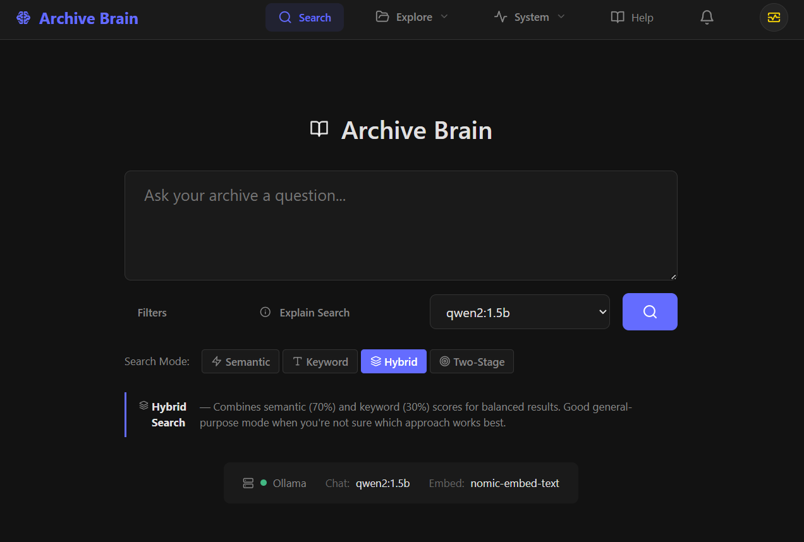
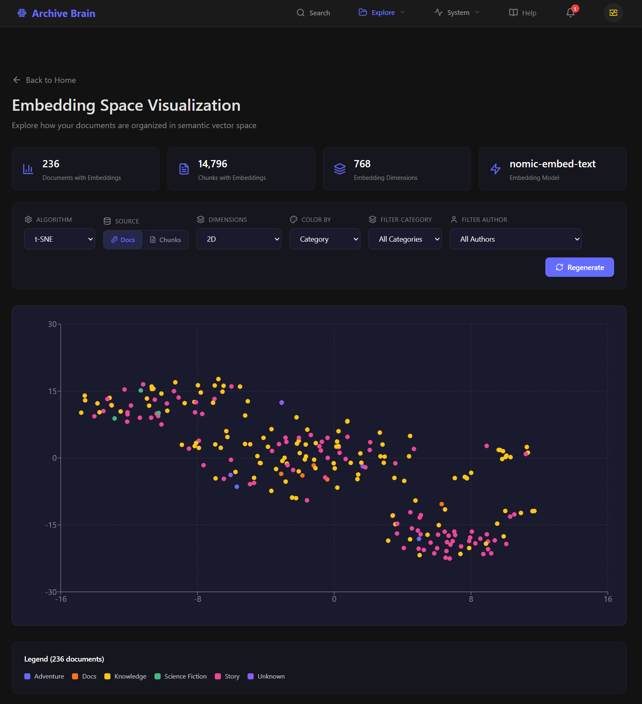

# Archive Brain

[](https://opensource.org/licenses/MIT)

Archive Brain is a **local-first document archive assistant**.  
It ingests your personal files, enriches them with metadata, and enables **semantic search and Retrieval-Augmented Generation (RAG)** — all running on your own machine.

This project is designed for people who want to *understand* and *explore* their archives, not ship their data to the cloud.

---


## ✨ What Archive Brain Does

- Ingests documents from local folders
- Extracts text from PDFs, images (OCR), and plain text
- Segments large documents into meaningful chunks
- Uses local LLMs to generate:
  - Titles
  - Summaries
  - Tags
- Builds vector embeddings for semantic search
- Lets you ask natural-language questions over your archive

<p align="center">
  
  <br><em>Main semantic search interface</em>
</p>

All processing runs locally via Docker and Ollama.

---

## 🔐 Data & Privacy Model

Archive Brain is **local-first by default**.

- Files are read from your local filesystem
- All processing happens inside Docker containers on your machine
- LLM inference runs via Ollama (local or self-hosted)
- No data is sent to external services unless *you explicitly configure it*

If you point the system at a remote LLM or external API, you control that tradeoff.

---

## 🚀 Quick Start

```bash
docker compose -f docker-compose.yml --profile prod up -d --build
```

On first run, the system will download required LLM models (several GB).
You can monitor progress with:

```bash
docker compose -f docker-compose.yml --profile prod logs -f ollama-init
```

Once running, open:

* **Web UI:** [http://localhost:3000](http://localhost:3000)
* **API:** [http://localhost:8000](http://localhost:8000)

That’s it — the ingestion pipeline starts automatically.

➡️ **New here?**
Read **[`docs/first-run.md`](docs/first-run.md)** for what to expect on first startup.

---

## 📂 Adding Your Documents

Archive Brain runs in Docker, so folders from your host system must be explicitly
mounted before they can be indexed.

This is a one-time setup step and is required before your files will appear in the UI.

➡️ **Read:** [Adding Folders to Archive Brain](docs/ADDING_FOLDERS.md)

---


## 🧠 How It Works (High Level)

Archive Brain runs a background pipeline:

1. **Ingest** – Scan folders and extract raw content
2. **Segment** – Split content into logical chunks
3. **Enrich** – Generate metadata using LLMs
4. **Embed** – Create vector embeddings for search
5. **Retrieve & Generate** – Power semantic search and Q&A

<p align="center">
  
  <br><em>Dashboard: pipeline status and progress</em>
</p>

➡️ For details, see **[`docs/architecture.md`](docs/architecture.md)**.

---

## 📦 Supported File Types

| Type      | Extensions                               | Notes                     |
| --------- | ---------------------------------------- | ------------------------- |
| Text      | `.txt`, `.md`, `.html`                   | Full text extraction      |
| PDF       | `.pdf`                                   | Text + OCR fallback       |
| Images    | `.jpg`, `.png`, `.gif`, `.webp`, `.tiff` | OCR + vision descriptions |
| Documents | `.docx`                                  | Planned                   |

---

## ⚙️ Configuration

```bash
cp .env.example .env
```

Key settings:

* `OLLAMA_MODEL` – Chat model
* `OLLAMA_EMBEDDING_MODEL` – Embedding model
* `OLLAMA_VISION_MODEL` – Vision model
* `DB_PASSWORD` – Database password

Source folders and file types are defined in:

```text
config/config.yaml
```

---

## 🖥️ Deployment Options

### Default (Recommended)

Self-contained Docker setup with Ollama included:

```bash
docker compose -f docker-compose.yml --profile prod up -d
```

### NVIDIA GPU Acceleration

Requires NVIDIA Container Toolkit:

```bash
docker compose -f docker-compose.yml -f docker-compose.gpu.yml --profile prod up -d
```

### External Ollama (Advanced)

Run Ollama on the host or another machine:

```bash
export OLLAMA_URL=http://host.docker.internal:11434
docker compose -f docker-compose.yml -f docker-compose.external-llm.yml --profile prod up -d
```

---

## 🔄 Re-running & Iteration

* Pipeline steps are designed to be **idempotent**
* Re-running ingestion will skip unchanged files
* Metadata and embeddings are reused when possible

To reset everything:

```bash
docker compose -f docker-compose.yml --profile prod down -v
docker compose -f docker-compose.yml --profile prod up -d --build
```

---

## 🚧 Current Limitations

* Single-user only
* No authentication or access control
* Not optimized for real-time ingestion
* Large archives may require batching or GPU acceleration

---


## 🧬 Embeddings Visualization

<p align="center">
  
  <br><em>Visualize document and chunk embeddings</em>
</p>

## 🛠️ Tech Stack

* PostgreSQL + pgvector
* Python + FastAPI
* React + Vite
* Apache Tika, Tesseract OCR
* Ollama (LLMs)
* Docker Compose

---

## 📚 Documentation

* **First Run Guide:** [`docs/first-run.md`](./docs/first-run.md)
* **Adding Source Folders:** [`docs/ADDING_FOLDERS.md`](docs/ADDING_FOLDERS.md)
* **Architecture Overview:** [`docs/architecture.md`](./docs/architecture.md)

---

## 📄 License

[MIT](./LICENSE)


